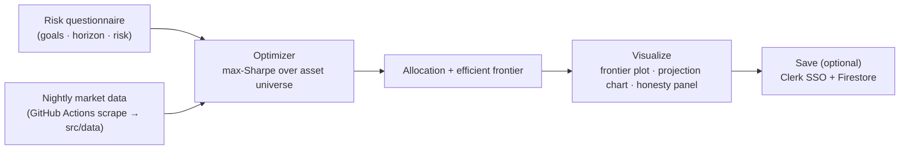

# Portfolio Lab

**Max-Sharpe portfolio optimization studio for India — browser-only, no sign-up, no data leaves your device.**

[](LICENSE)
[](https://github.com/chirag127/oriz-portfolio-lab/stargazers)
[](https://github.com/chirag127/oriz-portfolio-lab/commits)
[](https://astro.build/)
[](https://github.com/chirag127/oriz-portfolio-lab/actions/workflows/ci.yml)

Answer a short risk questionnaire and Portfolio Lab computes a **maximum-Sharpe**
allocation across equity, international ETFs, gold, REITs and more, then shows the
efficient frontier, projected compounding, and the honest downside of every
assumption. Everything runs in your browser — nightly market data is committed to the
repo by a scrape job, and the optimizer itself never sends your inputs anywhere.

- **Live site:** https://portfolio-lab.oriz.in
- **GH Pages landing:** https://chirag127.github.io/oriz-portfolio-lab/
- **Repo:** https://github.com/chirag127/oriz-portfolio-lab

⭐ If this is useful, please **star the repo** — it helps others find it.

## How it works



## Features

- **Risk questionnaire → allocation** — maps goals, horizon and risk appetite to a
  target portfolio.
- **Max-Sharpe optimizer** — computes the tangency (best risk-adjusted) portfolio over
  the asset universe; plots the efficient frontier.
- **Projection charts** — past-performance and forward compounding curves per rupee.
- **Honesty panel** — surfaces the downside/drawdown of every assumption instead of
  hiding it.
- **Save portfolios** (optional) — Clerk SSO across `*.oriz.in` + Firestore; the free
  studio works fully without any account.
- **Browser-only** — your inputs never leave the device; auth gates only saved
  portfolios, never the analysis.

## Tech stack

- [Astro 6](https://astro.build/) static + [React 19](https://react.dev/) islands
- [Recharts](https://recharts.org/) (frontier + projection charts),
  [Tailwind CSS 4](https://tailwindcss.com/), [lucide-react](https://lucide.dev/)
- Shared `@chirag127/*` packages: `astro-shell`, `astro-chrome`, `astro-data`, `oriz-ui`
- [Clerk](https://clerk.com/) (auth) + [Firebase](https://firebase.google.com/) Firestore
- Tooling: [Biome](https://biomejs.dev/), [Vitest](https://vitest.dev/),
  [Playwright](https://playwright.dev/); deployed via
  [Wrangler](https://developers.cloudflare.com/workers/wrangler/) to Cloudflare
- Package manager: pnpm 10 (Node ≥ 22)

## Repo structure

```
oriz-portfolio-lab/
├─ src/
│  ├─ lib/
│  │  ├─ optimizer.ts        # max-Sharpe / efficient-frontier math
│  │  ├─ finmath.ts          # returns, covariance, Sharpe helpers
│  │  ├─ projection.ts       # forward compounding projection
│  │  ├─ questionnaire.ts    # risk questionnaire → target weights
│  │  └─ __tests__/          # vitest unit tests for the math
│  ├─ components/
│  │  ├─ Questionnaire.tsx  AllocationStudio.tsx  FrontierPlot.astro
│  │  ├─ ProjectionChart.tsx  HonestyPanel.tsx  SavedPortfolios.tsx
│  │  └─ AccountIsland.tsx
│  ├─ data/                  # assets.json, market.json (nightly scrape output)
│  └─ pages/                 # index · questionnaire · portfolio · methodology · legal
├─ scripts/scrape.mjs        # nightly market-data scrape
├─ wrangler.toml             # Cloudflare deploy (portfolio-lab.oriz.in)
├─ package.json
└─ .github/workflows/        # ci · scrape · megalinter · scorecard · mirror-to-gh-pages
```

## Screenshots

_Allocation studio + efficient frontier at [portfolio-lab.oriz.in](https://portfolio-lab.oriz.in)._

> _Screenshot placeholder — add `public/screenshot.png` once captured._

## Quick start

```bash
pnpm install
pnpm dev            # local dev server (astro dev)
pnpm build          # static build → dist/
pnpm test           # vitest unit tests
pnpm scrape         # refresh src/data from market sources
pnpm deploy         # wrangler deploy → Cloudflare
```

> On Windows, if a pnpm build fails on the esbuild binary, use
> `npm install --legacy-peer-deps && npm run build`.

## Configuration

Public, client-exposed env vars only (`PUBLIC_*`). Names + purpose — **never commit values**:

| Variable | Purpose |
|---|---|
| `PUBLIC_CLERK_PUBLISHABLE_KEY` | Clerk publishable key (cross-subdomain SSO) |
| `PUBLIC_FIREBASE_API_KEY` | Firebase web API key (Firestore only) |
| `PUBLIC_FIREBASE_AUTH_DOMAIN` | Firebase auth domain |
| `PUBLIC_FIREBASE_PROJECT_ID` | Firebase project id |
| `PUBLIC_FIREBASE_STORAGE_BUCKET` | Firebase storage bucket |
| `PUBLIC_FIREBASE_MESSAGING_SENDER_ID` | Firebase messaging sender id |
| `PUBLIC_FIREBASE_APP_ID` | Firebase app id |
| `PUBLIC_ENABLE_CF_ANALYTICS` | Toggle Cloudflare Web Analytics |
| `PUBLIC_CF_BEACON_TOKEN` | Cloudflare analytics beacon token |

Clerk secret keys and any server credentials are never exposed as `PUBLIC_*` and never
committed. Secrets live in a sops + age vault.

## Part of the oriz family

One of ~80 sites in the [oriz](https://blog.oriz.in) family — a solo-run fleet of
finance tools, blogs, and utilities. Portfolio Lab runs **$0 on the Cloudflare free
tier** (static assets + a nightly GitHub Actions scrape).

## Contributing

Issues and PRs welcome. Conventional commits — they **are** the changelog.

## License

MIT © Chirag Singhal — chirag@oriz.in

## Status / roadmap

Production. Roadmap: wider asset universe, tax-aware after-return projections,
scenario stress-testing.

---

**Disclaimer:** General information, not investment advice. Optimizer output is a
model, not a recommendation — do your own research.
